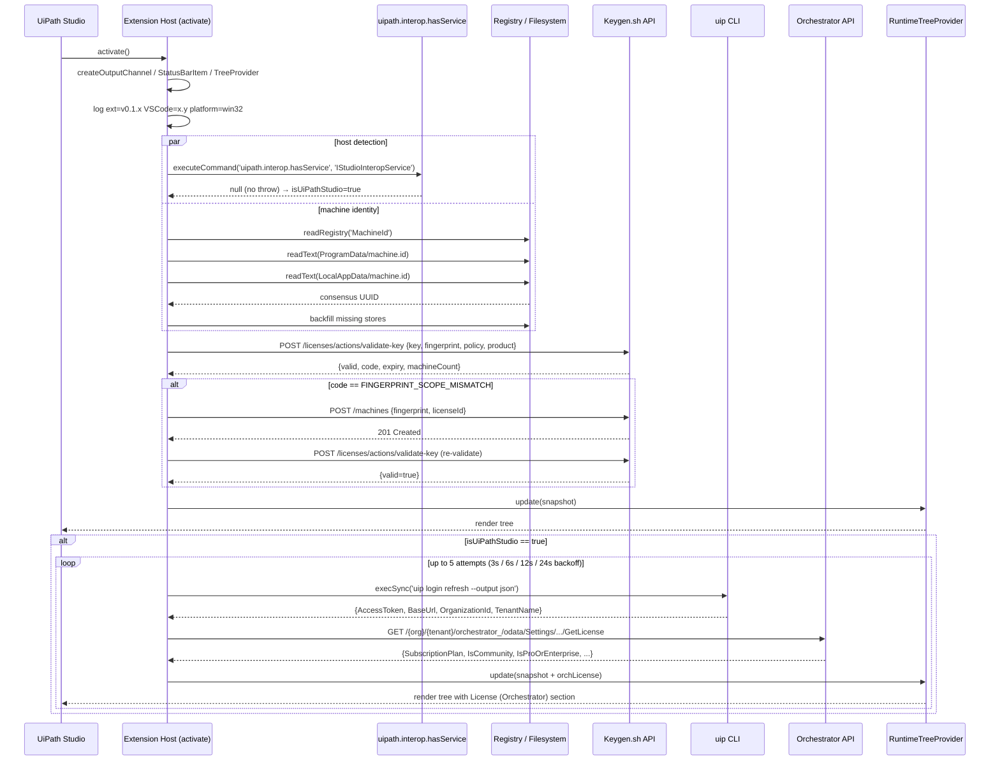

# Extension Activation Sequence

## Notes

- `isUiPathStudio` detection: command exists in Studio (returns `null`, no throw); throws in VS Code.
- Keygen machine activation only runs when `code == FINGERPRINT_SCOPE_MISMATCH` — once per machine per license key.
- Orchestrator fetch is **auto** in Studio (silent retries), **manual** via `$(plug)` button in VS Code.
- Tree renders once after `runLicenseCheck`; Orchestrator section populates asynchronously on success.
- All auth for Orchestrator comes from `uip` CLI — no credentials stored in extension.
